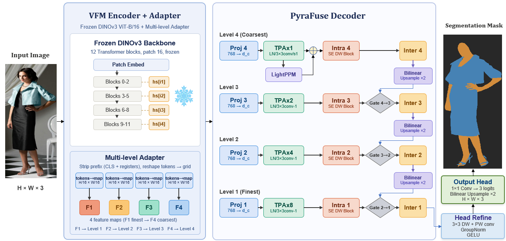
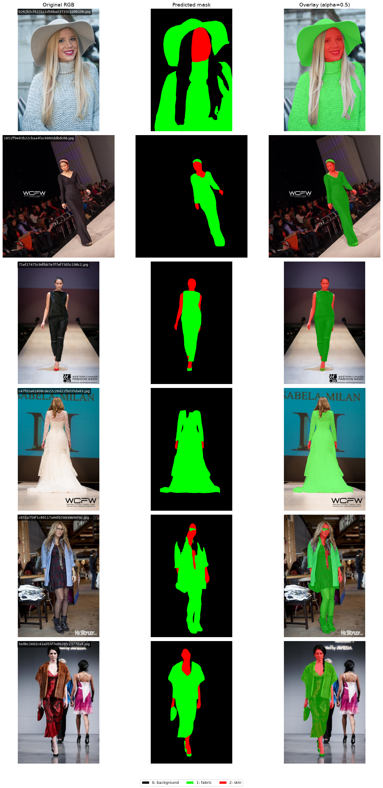
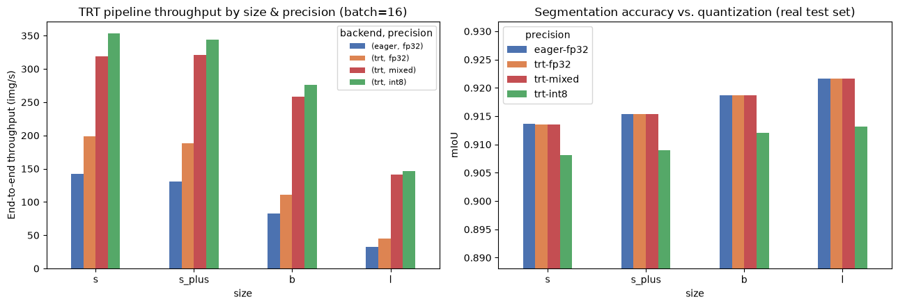
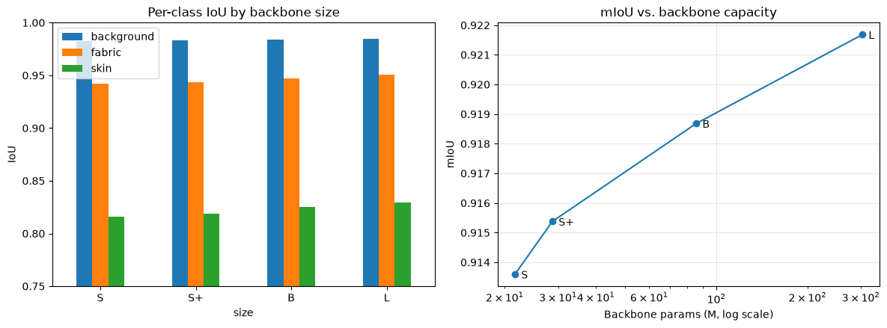

# PyraFuse

<p align="center">
  
</p>

<p align="center">
  <a href="paper/PyraFuse_SkinFabric_VFM%20-%20db.pdf">Paper</a> · <a href="#model-zoo">Model zoo</a> · <a href="#inference">Inference</a> · <a href="#dataset">Dataset</a>
</p>

PyraFuse is a DINOv3-based semantic-segmentation framework for **skin, fabric, and background**. It combines multi-scale vision-foundation-model features with a lightweight PyraFuse decoder, and supports research-grade PyTorch inference as well as GPU-specific TensorRT deployment.

The accompanying paper has been accepted at **AIMLSystems 2026**. This repository contains the code, reproducible data-preparation pipeline, inference notebooks, model-zoo interface, and accepted manuscript.

<p align="center">
  
</p>

## Highlights

- Three-class dense prediction: `0 = background`, `1 = fabric`, `2 = skin`.
- DINOv3 ViT-S, ViT-S+, ViT-B, and ViT-L encoder variants.
- A self-contained checkpoint format: configuration, decoder, adapter calibration layers, complete backbone, and optional EMA weights.
- One model-zoo API for a local checkpoint or a Hugging Face model repository.
- ONNX/TensorRT export with FP32, mixed FP16, and INT8 build options.

## Installation

Python 3.12+ is required. Install the base package for PyTorch/Hugging Face inference, then add the extras needed for data preparation or deployment.

```bash
git clone https://github.com/jamal-saeedi/PyraFuse.git
cd PyraFuse
python -m venv .venv
source .venv/bin/activate
pip install --upgrade pip
pip install -e ".[data,deploy]"
```

For TensorRT, use the NVIDIA TensorRT package that matches the CUDA runtime on the deployment machine; it is intentionally an optional dependency:

```bash
pip install -e ".[trt]"
```

## Model zoo

The four checkpoint variants are directory bundles, not single pickled files. The bundles are excluded from Git because the full backbones are large. On a development checkout, place them under `models/finals/`; for a public release, host the same folders in the official Hugging Face model repo.

| Variant | Encoder | Local checkpoint directory |
| --- | --- | --- |
| `small` | DINOv3 ViT-S/16 | `models/finals/small` |
| `small_plus` | DINOv3 ViT-S+/16 | `models/finals/small_plus` |
| `base` | DINOv3 ViT-B/16 | `models/finals/base` |
| `large` | DINOv3 ViT-L/16 | `models/finals/large` |

Each variant uses this portable layout:

```text
<variant>/
├── config.json
├── decoder.pt
├── ema.pt                     # evaluation weights, when available
└── backbone/
    ├── config.json
    ├── model.safetensors
    └── feature_norms.pt
```

Set the official Hub repository once it has been created (for example, `<namespace>/PyraFuse`):

```bash
export PYRAFUSE_MODEL_REPO=<namespace>/PyraFuse
```

`load_pretrained` checks a local `models/finals/<variant>` first, then downloads only the requested variant from that Hub repository. Pin `revision` to a Hub tag or commit SHA when reproducing an experiment.

```python
from pyrafuse import load_pretrained

model = load_pretrained(
    "base",
    repo_id="<namespace>/PyraFuse",  # optional when PYRAFUSE_MODEL_REPO is set
    revision="v1.0.0",              # recommended for reproducibility
    device="cuda",
)
```

The initial download is cached by `huggingface_hub`; later use can be offline:

```python
model = load_pretrained("base", local_files_only=True, device="cuda")
```

See [models/README.md](models/README.md) for the release checklist and exact upload command. Do not commit `.pt`, `.safetensors`, ONNX, or TensorRT engine binaries to this Git repository.

## Inference

PyraFuse expects ImageNet-normalised RGB tensors with spatial dimensions that are multiples of 16. The following minimal example predicts the class map for one image using an EMA checkpoint:

```python
import numpy as np
import torch
from PIL import Image
from pyrafuse import load_pretrained

device = "cuda" if torch.cuda.is_available() else "cpu"
model = load_pretrained("base", device=device)

image = Image.open("example.jpg").convert("RGB").resize((448, 448))
array = np.asarray(image, dtype=np.float32) / 255.0
mean = torch.tensor((0.485, 0.456, 0.406)).view(3, 1, 1)
std = torch.tensor((0.229, 0.224, 0.225)).view(3, 1, 1)
pixel_values = (torch.from_numpy(array).permute(2, 0, 1) - mean) / std

with torch.inference_mode():
    prediction = model(pixel_values.unsqueeze(0).to(device)).argmax(1)[0]

# prediction values: 0=background, 1=fabric, 2=skin
Image.fromarray(prediction.cpu().numpy().astype(np.uint8)).save("prediction.png")
```

For a complete visual PyTorch/TensorRT walkthrough, use [notebooks/inference_torch_and_tensorrt.ipynb](notebooks/inference_torch_and_tensorrt.ipynb).

## TensorRT deployment

TensorRT engines are compiled artifacts, not portable checkpoints: an engine must match the target GPU architecture, TensorRT version, CUDA runtime, precision, and optimization profile. Distribute the eager PyTorch checkpoint as the source of truth and either build engines on the target host or publish them in a clearly labelled, separate Hub subfolder.

```bash
python scripts/export_trt.py \
  --ckpt models/finals/base \
  --out-dir models/trt_pipeline/base \
  --label base \
  --precision fp32 mixed int8 \
  --min-batch 1 --opt-batch 1 --max-batch 1 \
  --verify
```

INT8 should be calibrated with representative, preprocessed images for production. Always run `--verify` and evaluate on held-out images after building an engine.

<p align="center">
  
  
</p>

## Dataset

The training labels fuse Fashionpedia fashion annotations with visuAAL skin masks. Data is not versioned in Git. The preparation script downloads missing source files and builds three-class masks; it is safe to re-run.

```bash
python scripts/prepare_data.py
python scripts/prepare_data.py --help
```

The [dataset notebook](notebooks/skin_fabric_dataset.ipynb) documents source data, label creation, dataloaders, class balance, and skin-tone analysis. Please comply with the licences and terms of the source datasets.

## Repository layout

```text
pyrafuse/
├── pyrafuse/       # model, data, training, deployment, and model-zoo code
├── scripts/        # data preparation and TensorRT export CLIs
├── notebooks/      # dataset and inference walkthroughs
├── models/         # ignored local checkpoints; tracked manifests and guidance
├── images/         # paper figures and qualitative results
├── paper/          # accepted AIMLSystems 2026 manuscript
└── tests/          # lightweight API tests
```

## Reproducibility and release practice

- Use the EMA weights for evaluation (`load_pretrained(..., use_ema=True)`).
- Record the Git commit, Hub revision, model variant, input size, dataset split, metric implementation, CUDA/TensorRT versions, and precision.
- Tag the GitHub code release and corresponding Hugging Face model revision with the same semantic version, such as `v1.0.0`.
- Keep raw data, credentials, experiment logs, and binary model artifacts out of Git. The current `.gitignore` enforces this policy.

## Citation

The manuscript is accepted at AIMLSystems 2026 and is not yet formally published. Citation metadata will be added with the camera-ready bibliographic details. Until then, please link this repository and included accepted manuscript rather than inventing a DOI or page range.

## Licence

The release licence has not yet been selected. Add a `LICENSE` file before public distribution or reuse of code and weights.

## Tags

`skin-fabric-detection` · `skin-segmentation` · `fabric-segmentation` · `semantic-segmentation` · `DINOv3` · `TensorRT`
